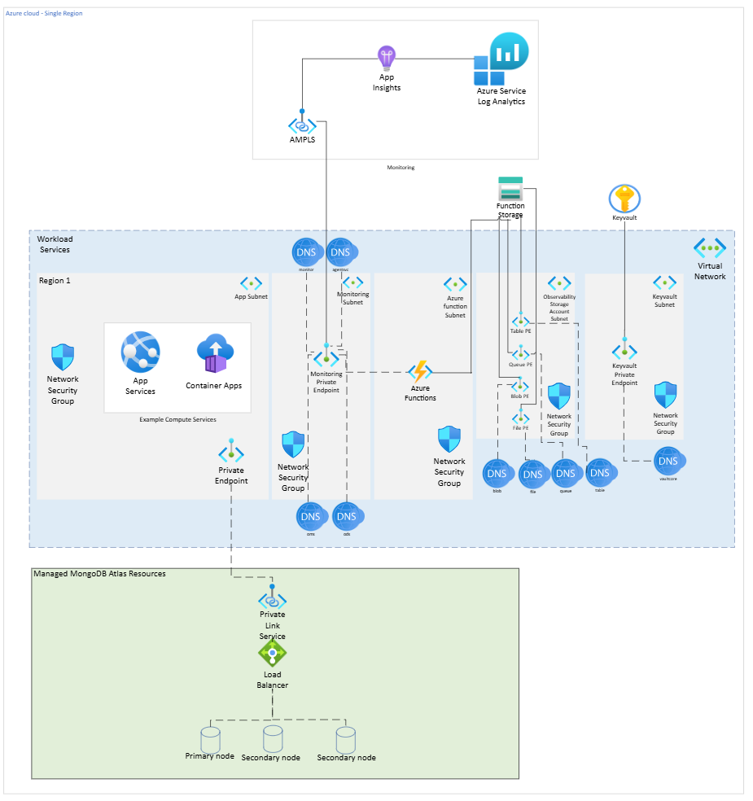
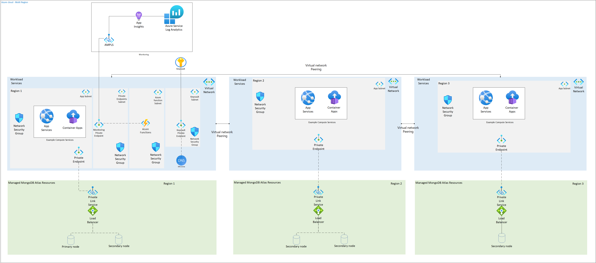

# Welcome to the MongoDB Atlas Azure Landing Zone Accelerator Wiki

This wiki provides comprehensive guidance for automating the deployment of MongoDB Atlas on Azure using the Landing Zone Accelerator pattern.  
The solution uses Terraform for infrastructure automation and supports both single-region and multi-region deployment scenarios.

---

## Architecture

**Single-Region Deployment**

**Multi-Region Deployment**

---

## Quick Navigation

### 1. Getting Started
- [Prerequisites](./Prerequisites.md): What you need before you begin
- [Setup Environment](./Setup-environment.md): How to configure your environment

### 2. Deployment Methods
- [Deploy with Pipeline](./Deploy-with-pipeline.md): Automated deployment using CI/CD workflows
- [Deploy with Manual Steps](./Deploy-with-manual-steps.md): Step-by-step manual deployment guide

### 3. Validation & Testing
- [Test DB Connection Steps](./Test_DB_connection_steps.md): Validate cluster connectivity

### 4. Help & Reference
- [Frequently Asked Questions](./FAQ.md): Common questions and answers
- [Known Issues](./KnownIssues.md): Current limitations and workarounds

### 5. Additional Documentation
- [Modules](./Modules.md): Terraform modules provided and usage instructions

---
